# Climate ETL Pipeline - Data Engineering Portfolio Project

A complete **ETL pipeline** that extracts, transforms, and visualizes climate data from multiple European cities in real-time. Built with modern data engineering tools and designed for production.

## Overview

This project demonstrates a professional **data engineering pipeline** that:
- **Extracts** weather data from Open-Meteo API for 6 European cities
- **Transforms** JSON data into structured tables with calculated metrics
- **Loads** clean data into PostgreSQL with UPSERT operations
- **Visualizes** results in an interactive Power BI dashboard
- **Orchestrates** everything with Apache Airflow in Docker containers

Perfect for **portfolio showcase** and demonstrating real-world data engineering skills.

---

## Architecture

```mermaid
graph TB
    A[Open-Meteo API] --> B[Airflow DAG]
    B --> C[(PostgreSQL RAW<br/>weather_raw)]
    C --> D[WeatherTransformer]
    D --> E[(PostgreSQL PROCESSED<br/>weather_processed)]
    E --> F[Power BI Dashboard]
    
    style A fill:#9e1f16
    style B fill:#0e7b96
    style C fill:#053e4d
    style D fill:#054d0c
    style E fill:#4d054b
```

##  Features

### **Real-time Data Extraction**
- Automated API calls to Open-Meteo for 6 European cities
- Complete weather parameters: temperature, humidity, precipitation, wind
- Dynamic configuration via `cities` table in PostgreSQL

###  **Transformation**
- **Feels-like temperature calculation** using official formulas:
  - **Wind Chill** for temperatures ≤10°C with wind >4.8 km/h
  - **Heat Index** for temperatures ≥27°C
  - Wind adjustment for temperate conditions
- ISO timestamp parsing to tabular structure
- Real-time data validation and cleaning

### **Optimized Storage**
- **PostgreSQL 13** with normalized tables
- **Smart UPSERT** to avoid duplicates (`ON CONFLICT DO UPDATE`)
- Optimized indexes for fast queries
- Complete historical data with traceability

### **Professional Orchestration**
- **Apache Airflow 2.7** for scheduling and monitoring
- **Modular DAGs** with explicit dependencies
- **Structured logging** for debugging
- **Automatic retry** with exponential backoff

## Tech Stack

| Technology | Version | Purpose |
|------------|---------|---------|
| **Apache Airflow** | 2.7.1 | Pipeline orchestration and scheduling |
| **PostgreSQL** | 13 | Structured data storage |
| **Docker** | 20.10+ | Containerization and deployment |
| **Python** | 3.9 | Transformation logic and ETL |
| **Power BI** | Latest | Data visualization and dashboarding |
| **Open-Meteo API** | v1 | Weather data source |
| **pytest** | 7.4+ | Testing and code quality |
| **psycopg2** | 2.9+ | PostgreSQL connection from Python |